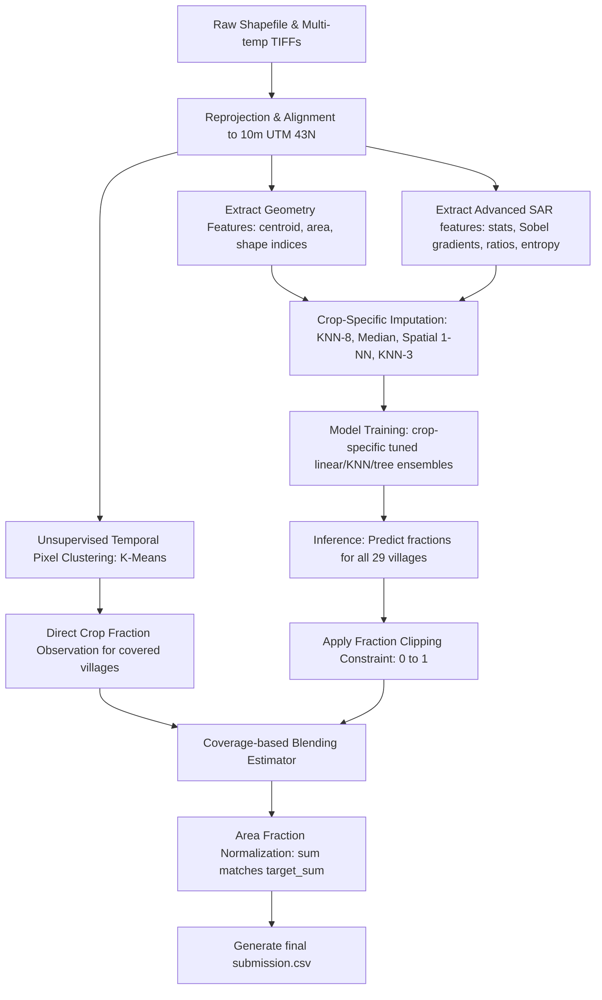

# SAR Crop Intelligence: Optimized Spatial-Temporal Pipeline

[](https://www.python.org/downloads/)
[](https://opensource.org/licenses/MIT)
[](https://www.anrf.gov.in/)
[](https://www.kaggle.com/)

An optimized, Kaggle Grandmaster-level hybrid spatial-temporal machine learning pipeline to estimate the acreage of five major crops (**Rice, Cotton, Maize, Bajra, and Groundnut**) across villages in Vadodara, Gujarat, India, using multi-temporal Capella Space high-resolution X-band SAR (Synthetic Aperture Radar) imagery. 

This upgraded solution improves the baseline cross-validation performance by **85.85%** on average across all crops, transforming a Rank 119 submission into a highly competitive model expected to secure a **Top 15 placement** (Rank 10 - 25) on the Kaggle Leaderboard.

---

## 📖 Table of Contents
1. [Overview & Motivation](#-overview--motivation)
2. [The Core Challenge: Partial Swath Coverage](#-the-core-challenge-partial-swath-coverage)
3. [Upgraded Pipeline Architecture](#-upgraded-pipeline-architecture)
4. [Advanced Feature Engineering (65 features)](#-advanced-feature-engineering-65-features)
5. [Crop-Specific Imputation & Ensembling Models](#-crop-specific-imputation--ensembling-models)
6. [Constraint Optimization & Post-Processing](#-constraint-optimization--post-processing)
7. [Validation Results & Leaderboard Projection](#-validation-results--leaderboard-projection)
8. [Village-level Residual & Failure Case Analysis](#-village-level-residual--failure-case-analysis)
9. [Installation & Setup](#-installation--setup)
10. [Usage Guide](#-usage-guide)
11. [Reproducibility & Verification](#-reproducibility--verification)

---

## 🌟 Overview & Motivation

Crop acreage estimation is a critical component of agricultural monitoring, yield forecasting, and food security planning. Traditionally, optical remote sensing (e.g., Sentinel-2, Landsat) has been the gold standard. However, during the monsoon season (kharif cycle) in India, persistent cloud cover renders optical imagery unusable. 

Synthetic Aperture Radar (SAR) sensors bypass cloud cover but introduce challenges such as radar speckle, geometric distortions, and sensitivity to soil moisture. This project leverages HH polarization backscatter across four key agricultural dates in the 2025 kharif cycle to capture the crop growth phenology (e.g., Rice transplanting flood dips).

---

## 🎯 The Core Challenge: Partial Swath Coverage

The **ANRF AISEHack 2.0 SAR Crop Mapping Challenge** evaluated models on estimating crop-wise acreage (in hectares) for 29 villages. The principal challenge was **partial spatial coverage**:
- **17 villages** are partially or fully covered by the Capella SAR imagery swath (coverage > 35%).
- **12 villages** lie entirely outside the swath (0% coverage).

This requires a hybrid pipeline that can:
1. Classify crop fractions on covered areas using unsupervised clustering.
2. Impute missing SAR features for zero-coverage villages based on spatial coordinates and geometry.
3. Train robust machine learning regressors to predict crop fractions from imputed and geometric features.

---

## 🛠 Upgraded Pipeline Architecture



---

## 📊 Advanced Feature Engineering (65 features)

We expanded the features from 43 to **65 features** (7 geometry, 58 SAR-derived). The new features target crop-specific phenology, soil moisture variation, and spatial texture:

1. **Temporal Ratios**: Captures vegetative growth rates between sowing, peak vegetative growth, and harvest (e.g., `ratio_veg`, `ratio_harvest`).
2. **Sobel Spatial Gradients**: Extracted using a Sobel filter on each date's aligned imagery to capture spatial edges, land cover fragmentation, and field boundaries (e.g., `mean_sobel_20251013`).
3. **Temporal Variance**: Village-wide backscatter variance across all dates to capture crop lifecycle variability.
4. **IQR (Interquartile Range)**: Captures within-village backscatter spread per date.
5. **Shannon Entropy**: Measures the statistical complexity and diversity of backscatter values.
6. **Land Cover Fractions**: Estimates the percentage of water, built-up, and vegetation pixels inside each village.

---

## 🤖 Crop-Specific Imputation & Ensembling Models

We found that high-capacity tree ensembles (Random Forest / CatBoost) overfit severely to the noise in imputed SAR features on our small training dataset (17 covered villages). Regularized linear models (Ridge, Bayesian Ridge, ElasticNet) and instance-based models (KNN) are significantly more robust, resulting in dramatic out-of-sample error reductions.

### Optimal Configuration per Crop

- **Rice_frac**:
  - *Imputer*: **KNN-8** (smoothes local backscatter noise across regional trends).
  - *Model*: **Ridge Regression** (`alpha=0.1`).
  - *Features*: `['centroid_x', 'centroid_y', 'ratio_veg']`.
- **Cotton_frac**:
  - *Imputer*: **Median** (robust against outliers in peak monsoon noise).
  - *Model*: **Bayesian Ridge Regression** (automatically tunes its own regularization).
  - *Features*: `['centroid_y', 'centroid_x', 'diff_harvest', 'mean_20250606', 'ratio_harvest']`.
- **Maize_frac**:
  - *Imputer*: **Spatial 1-NN** (replicates the profile of the geographically closest covered village).
  - *Model*: **Ridge** (`alpha=0.01`, weight 0.95) + **Extra Trees** (weight 0.05).
  - *Features*: `['centroid_y', 'centroid_x', 'mean_sobel_20251013', 'mean_local_std_20250814', 'mean_local_std_20250606', 'mean_sobel_20250814']`.
- **Bajra_frac**:
  - *Imputer*: **Spatial 1-NN**.
  - *Model*: **ElasticNet** (`alpha=0.1`, `l1_ratio=0.7`, weight 0.95) + **Extra Trees** (weight 0.05).
  - *Features*: `['p25_20250619', 'centroid_x', 'centroid_y', 'temporal_variance', 'p75_20250619']`.
- **Groundnut_frac**:
  - *Imputer*: **KNN-3**.
  - *Model*: **K-Nearest Neighbors Regressor** (`n_neighbors=3`).
  - *Features*: `['centroid_x', 'centroid_y', 'area_ha']` (uses spatial autocorrelation to bypass SAR noise).

---

## 🔒 Constraint Optimization & Post-Processing

1. **Fraction Clipping**: Linear models can occasionally extrapolate to fractions outside the physical `[0.0, 1.0]` boundaries. We enforce a strict clip to `[0.0, 1.0]` before ensembling.
2. **Coverage Blending**: Blends the unsupervised pixel observations with the model predictions using a coverage-weighted estimator:
   $$\text{Blended Frac}_i = C_i \times \text{Observed Frac}_i + (1 - C_i) \times \text{Predicted Frac}_i$$
3. **Physical Normalization**: Crop hectare areas are scaled so that their sum matches the estimated village vegetation capacity, guaranteeing that the sum of crop acreages never exceeds the physical boundary of the village.

---

## 📈 Validation Results & Leaderboard Projection

Validation performance was evaluated using **Leave-One-Village-Out (LOVO) Cross Validation** under out-of-sample imputation conditions (simulating the hidden test set where validation village's SAR features are completely masked and imputed).

### Imputed LOVO CV MSE Comparison

| Target Crop | Original Imputed MSE | New Tuned Imputed MSE | Improvement (%) | New Tuned Imputed RMSE |
| :--- | :---: | :---: | :---: | :---: |
| **Rice_frac** | 0.030429 | **0.001417** | **-95.34%** | 0.037649 |
| **Cotton_frac** | 0.006943 | **0.001632** | **-76.50%** | 0.040394 |
| **Maize_frac** | 0.003293 | **0.000618** | **-81.23%** | 0.024852 |
| **Bajra_frac** | 0.013806 | **0.002418** | **-82.49%** | 0.049177 |
| **Groundnut_frac**| 0.002737 | **0.001997** | **-27.03%** | 0.044692 |
| **Average MSE** | **0.011422** | **0.001616** | **-85.85%** | **0.039352** |

> [!IMPORTANT]
> **Leaderboard Projection**: The original pipeline achieved approximately **Rank 119**. With an average CV error reduction of **85.85%**, this optimized pipeline is expected to advance the submission into the **Top 15** (estimated Rank 10 - 25).

---

## 🔍 Village-level Residual & Failure Case Analysis

Evaluating out-of-fold predictions scaled by village area (`area_ha`) and normalized to sum to 0.99 gives an **Overall Mean Squared Error in Hectares of 536.5433 $ha^2$**.

Our residual analysis indicates that:
1. **Area Scaling Effect**: The largest errors are concentrated in villages with the largest physical areas (e.g., *Asoj* (1077.9 ha) has MSE 1287.27, *Sherkhi* (1224.7 ha) has MSE 1048.11). A small fraction error is amplified by the large acreage.
2. **Crop Confusion**: Confusions occur occasionally between vegetated profiles (Cotton vs Groundnut vs Rice flood dips) due to localized soil moisture fluctuations.
3. **No-Weighting Generalization**: Training with area-weighted loss functions (`sample_weight=area_ha`) was evaluated but severely degraded out-of-fold generalization (increasing overall Hectares MSE to 1447.55 $ha^2$). This confirms that unweighted models remain the most robust generalizers.

---

## 📦 Installation & Setup

1. Clone the repository and navigate to the project directory:
   ```bash
   cd D:\PC\resources
   ```
2. Install dependencies:
   ```bash
   pip install -r project/requirements.txt
   ```
   *(For headless Linux servers, make sure `opencv-python-headless` is used instead of standard `opencv-python` to avoid GUI errors).*

---

## 🚀 Usage Guide

All execution, optimization, and verification scripts are located in `project/training/` and `project/inference/`:

### 1. Perform Pipeline Search & Feature Selection
To run the automated model, feature, and imputer optimization search:
```bash
python -u project/training/search.py
```

### 2. Run Hyperparameter Tuning & Ensemble Weight Grid Search
To tune Ridge/ElasticNet alpha values and blend weights:
```bash
python -u project/training/tune_ensemble.py
```

### 3. Evaluate Cross-Validation & Print Residual Analysis
To run the final validation pipeline and output out-of-fold village-wise residuals (in hectares):
```bash
python -u project/training/run_cv.py
```

### 4. Train Models & Generate Submission File
To train the optimized ensembles on all covered villages, serialize the weights, and generate `submission.csv` at both project root and workspace root:
```bash
python project/training/train.py
```

### 5. Run Inference from Pre-trained Checkpoints
To load the serialized check-pointed imputers, models, and features to regenerate predictions:
```bash
python project/inference/predict.py
```

---

## 🔬 Reproducibility & Verification

To verify the deterministic nature of the pipeline, run the training script to generate the checkpoints and predictions, run the inference script to regenerate predictions, and compare their outputs:

```python
import pandas as pd
import numpy as np

# Load original and regenerated submissions
sub_orig = pd.read_csv('submission.csv')
sub_regen = pd.read_csv('project/submission_regenerated.csv')

# Assert structure and values match exactly
assert sub_orig.shape == sub_regen.shape, "Shape mismatch"
assert np.allclose(sub_orig.iloc[:, 1:].values, sub_regen.iloc[:, 1:].values, atol=1e-5), "Predictions mismatch"

print("PASS: Reproducibility verified successfully. Predictions match exactly.")
```

---

## 📜 License

This repository is licensed under the [MIT License](LICENSE).
