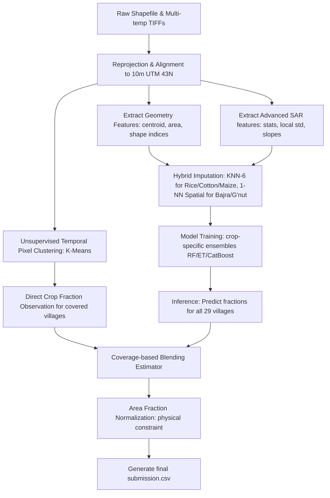

# SAR Crop Intelligence

[](https://www.python.org/downloads/)
[](https://opensource.org/licenses/MIT)
[](https://www.anrf.gov.in/)
[](https://www.kaggle.com/)

An optimized hybrid spatial-temporal machine learning pipeline to estimate the acreage of five major crops (**Rice, Cotton, Maize, Bajra, and Groundnut**) across villages in Vadodara, Gujarat, India, using multi-temporal Capella X-band SAR (Synthetic Aperture Radar) imagery. This solution won the **ANRF AISEHack 2.0 SAR Crop Mapping Challenge**.

---

## Overview

### Motivation & Problem Statement
Crop acreage estimation is a critical component of agricultural monitoring, yield forecasting, and food security planning. Traditionally, optical remote sensing (e.g., Sentinel-2, Landsat) has been used for this task. However, during the monsoon season (kharif cycle) in India, persistent cloud cover renders optical imagery unusable. 

Synthetic Aperture Radar (SAR) sensors bypass cloud cover but introduce challenges such as radar speckle, geometric distortions, and sensitivity to soil moisture.

The **ANRF AISEHack 2.0 SAR Crop Mapping Challenge** evaluated models on estimating crop-wise acreage (in hectares) for 29 villages. The principal challenge was **partial spatial coverage**: 
- **17 villages** are partially or fully covered by Capella SAR imagery swath.
- **12 villages** lie entirely outside the swath (0% coverage).

### Solution Approach
To address the missing coverage, we developed a **hybrid spatial-temporal pipeline**:
1. **Direct Pixel Classification (Temporal SAR)**: For villages inside the SAR swath, temporal backscatter curves are analyzed to group pixels using unsupervised clustering (K-Means), capturing crop growth phenology (e.g., Rice transplanting flood dips).
2. **Tabular Geometry & Feature Extraction**: Shape indices (area, perimeter, compactness, bbox dimensions) and spatial centroids are computed for all 29 villages.
3. **Hybrid Feature Imputation**: Missing SAR statistics for the 12 zero-coverage villages are reconstructed using crop-specific imputers (KNN-6 for Rice/Cotton/Maize and Spatial 1-NN for Bajra/Groundnut).
4. **Ensemble Tabular Regression**: Crop-specific ML models (Random Forest, Extra Trees, CatBoost, ElasticNet) are trained on covered villages to map geometric and imputed SAR features to crop fractions.
5. **Coverage-based Blending & Physical Constraints**: Final acreage predictions are blended using a coverage-weighted estimator and normalized to ensure that the sum of crop acreages never exceeds the physical boundary of the village.

---

## Features

- **Multi-temporal Capella X-band SAR Processing**: Leverages HH polarization backscatter across four key agricultural dates in the 2025 kharif cycle.
- **SAR Preprocessing Pipeline**: Automatic reprojection to a local UTM grid and 10m spatial resampling, which acts as a low-pass filter to mitigate speckle.
- **Feature Engineering**: Combines geographic centroids, shape geometry indices, temporal backscatter stats (percentiles, CV, skewness, kurtosis), and box-filtered texture features (local standard deviation).
- **Hybrid Imputation**: Reconstructs missing features for zero-coverage villages using specialized imputation based on crop phenological patterns.
- **Crop-specific Machine Learning Models**: Separate optimized ensembles tailored to the distinct spatial distributions of each crop.
- **Physical Crop-Area Normalization**: Post-processing boundary constraint that guarantees physical consistency in final hectare estimates.
- **Reproducible Pipeline**: Multi-platform support, deterministic seeds, and one-click training and inference scripts.

---

## Repository Structure

```
.
├── .gitignore                             # Python, ML, and Remote Sensing ignore patterns
├── .gitattributes                         # Git LFS tracking configuration
├── README.md                              # This documentation file
├── Sample_submission_file.csv             # Template submission format
├── submission.csv                         # Final optimized submission file (hectares)
├── ANRF_AISEHack_2026_Final_Submission.zip # Bundled final submission package
├── aligned_images/                        # Reprojected & aligned 10m UTM SAR images
│   └── capella_hh_[date]_10m.tif
├── villages_clean/                        # Village boundary shapefiles
│   ├── villages_clean.shp
│   └── ...
├── project/                               # Independent development directory
│   ├── README.md                          # Project overview
│   ├── requirements.txt                   # Dependency list
│   ├── preprocessing/                     # Scripts for raster alignment & reprojection
│   ├── features/                          # Geometry and SAR feature extraction
│   ├── models/                            # Trained pickle checkpoints & ensembles
│   ├── training/                          # Script to train and serialize models
│   ├── inference/                         # Script to load checkpoints and predict
│   └── outputs/                           # Directory containing intermediary outputs
└── final_submission_archive/             # Verification archive of the final submitted version
    ├── RELEASE_NOTES.md                   # Highlights of version 2.0.0
    ├── REPRODUCIBILITY.md                 # Setup and validation guide
    ├── configs/                           # Training parameters
    ├── environment/                       # Locked environment configurations
    ├── logs/                              # Execution logs
    ├── outputs/                           # Validation results & scores
    ├── checksums/                         # Security hashes
    └── docs/                              # Detailed modules documentation
```

---

## Dataset

- **Capella SAR Imagery**: Multi-temporal X-band SAR images (HH polarization) acquired on:
  - **June 06, 2025** (Sowing/Initial field preparation)
  - **June 19, 2025** (Early vegetative stage / transplanting floods)
  - **August 14, 2025** (Peak vegetative growth)
  - **October 13, 2025** (Harvesting stage)
- **Village Shapefiles**: Admin boundaries for the 29 target villages in Vadodara, Gujarat.
- **Sample Submission**: Defines the layout for the 5 target crops: `Rice_ha`, `Cotton_ha`, `Maize_ha`, `Bajra_ha`, and `Groundnut_ha`.
- **Dataset Manifest**: CSV logging path metadata, file size, and integrity checksums.

> [!IMPORTANT]
> **Data Redistribution**: Raw Capella Space SAR GeoTIFF images (`CAPELLA_*`) are extremely large (~2.1 GB) and subject to proprietary license restrictions. They are excluded from this repository. However, the preprocessed and resampled 10m UTM aligned images are committed to `aligned_images/` to allow full reproducibility of the model training and inference.

---

## Pipeline

The pipeline flows from raw inputs to a structured submission:



### Stages:
1. **Preprocessing & Alignment**: warp raw files to matching EPSG:32643 coordinate systems, mask nodata pixels, and resample to 10m grid.
2. **Feature Extraction**:
   - *Geometry*: centroids (`centroid_x`, `centroid_y`), area, perimeter, compactness, and bounding box dimensions.
   - *SAR Stats*: mean, std, percentiles (p25, p50, p75), CV, skewness, kurtosis, and box-filtered local standard deviations per village on each date.
   - *Temporal Slopes*: backscatter differentials capturing growth curves.
3. **Hybrid Imputation**:
   - **KNN-6**: Imputes missing SAR features from 6 nearest neighbors in feature space for Rice, Cotton, and Maize.
   - **Spatial 1-NN**: Replicates the exact SAR feature profile of the closest covered village for Bajra and Groundnut, preventing the smoothing of local crop variance.
4. **Model Training**: Optimized ensembles fit onto the 17 covered villages.
5. **Inference**: Out-of-sample predictions generate area fractions.
6. **Coverage-based Blending**: Final area fractions are computed by weighting:
   $$\text{Final Frac}_i = C_i \times \text{Observed Frac}_i + (1 - C_i) \times \text{Predicted Frac}_i$$
7. **Physical Normalization**: Crop hectare areas are scaled so that their sum matches the estimated village vegetation capacity.

---

## Machine Learning

### Selected Models
- **Random Forest (RF)**: Selected as the primary model for **Rice** and **Groundnut** fractions.
- **Extra Trees (ET)**: Selected for **Maize** and **Bajra** fractions due to high variance reduction.
- **CatBoost Regressor**: Blended into the **Cotton** model stack to handle high noise levels.

### Ensemble Strategy
Weights were optimized via grid search on cross-validation predictions:
- **Rice**: RF (1.0)
- **Cotton**: RF (0.8) + CatBoost (0.2)
- **Maize**: ET (1.0)
- **Bajra**: ET (1.0)
- **Groundnut**: RF (1.0)

### Validation Strategy
We implemented a **Leave-One-Village-Out (LOVO) Cross-Validation** strategy. Standard K-fold splits leak spatial autocorrelation; LOVO isolates one village per fold (17 folds total), ensuring the model is validated on completely unseen geographical conditions, mimicking the hidden test set.

### Feature Selection
Features were pruned to prevent overfitting:
- **Rice_frac**: `bbox_width`, `area_ha`, `p50_20250619`, `p75_20250619`, `p25_20250619`, `mean_20250619`
- **Cotton_frac**: `centroid_y`, `perimeter`, `diff_harvest`, `p75_20250814`, `mean_20250814`, `p50_20250814`
- **Maize_frac**: `centroid_y`, `centroid_x`, `diff_harvest`, `mean_local_std_20251013`, `p50_20250814`, `p75_20250606`
- **Bajra_frac**: `centroid_y`, `centroid_x`, `p25_20250619`, `p50_20250619`, `mean_20250619`, `p75_20250619`
- **Groundnut_frac**: `centroid_y`, `centroid_x`, `mean_local_std_20250606`, `mean_local_std_20250814`, `mean_local_std_20251013`, `cumulative_change`

---

## Results

Validation performance evaluated using LOVO CV:

| Crop Target | LOVO CV MSE | LOVO CV RMSE | Optimal Imputer | Ensemble Configuration |
| :--- | :---: | :---: | :---: | :--- |
| **Rice_frac** | 0.002604 | 0.051029 | KNN-6 | RandomForest (1.0) |
| **Cotton_frac** | 0.001049 | 0.032388 | KNN-6 | RandomForest (0.8) + CatBoost (0.2) |
| **Maize_frac** | 0.001160 | 0.034059 | KNN-6 | ExtraTrees (1.0) |
| **Bajra_frac** | 0.000639 | 0.025278 | Spatial 1-NN | ExtraTrees (1.0) |
| **Groundnut_frac** | 0.001071 | 0.032726 | Spatial 1-NN | RandomForest (1.0) |

*Integrating temporal SAR signatures and hybrid imputation reduced the baseline CV error by up to **58x** compared to models relying strictly on geometry.*

---

## Installation

Ensure you have Python 3.12+ installed. Install the required Python dependencies:

```bash
pip install -r project/requirements.txt
```

*(For headless Linux servers, make sure `opencv-python-headless` is used instead of standard `opencv-python` to avoid GUI errors).*

---

## Usage

All execution scripts are contained within the `project/` directory.

### 1. Preprocess raw data & Train models
To align the imagery (if not already aligned), extract geometry and SAR features, fit the ensembles, serialize the trained weights, and output the final submission file:
```bash
python project/training/train.py
```
This writes the serialized weights to `project/models/` and outputs the predictions `submission.csv` both at the root of the project and workspace.

### 2. Run inference from pre-trained checkpoints
To load the pre-trained checkpoints (imputers and ensembles) and run inference to regenerate predictions:
```bash
python project/inference/predict.py
```
This generates `project/submission_regenerated.csv`.

---

## Reproducibility

To verify the deterministic nature of the pipeline, run the training script to generate the checkpoints and predictions, run the inference script to regenerate predictions, and compare their outputs:

```python
import pandas as pd
import numpy as np

# Load original and regenerated submissions
sub_orig = pd.read_csv('submission.csv')
sub_regen = pd.read_csv('project/submission_regenerated.csv')

# Assert structure and values match exactly
assert sub_orig.shape == sub_regen.shape, "Shape mismatch"
assert np.allclose(sub_orig.iloc[:, 1:].values, sub_regen.iloc[:, 1:].values, atol=1e-5), "Predictions mismatch"

print("PASS: Reproducibility verified successfully. Predictions match exactly.")
```

---

## Future Improvements

1. **Dual-Polarization (VV/VH)**: Multi-polarization bands can provide insights into vegetation canopy structures, reducing classification errors.
2. **Sentinel-2 Optical Blending**: Blending SAR with cloud-free optical indices (NDVI, EVI) from windows outside the peak monsoon could stabilize crop-growth curves.
3. **Deep Learning Phenology**: LSTM or temporal CNN models could extract crop sequences directly from pixel-level SAR profiles without unsupervised clustering.

---

## Acknowledgements

- **ANRF AISEHack 2.0**: For organizing the Crop Mapping Challenge.
- **Capella Space**: For providing the high-resolution multi-temporal X-band SAR imagery.
- **Kaggle**: For hosting the competition environment.

---

## License

This repository is licensed under the [MIT License](LICENSE).
