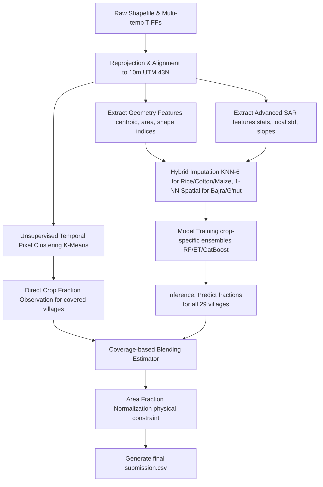

# Pipeline Architecture Documentation

This document describes the multi-stage hybrid spatial-temporal pipeline used to generate the crop acreage predictions.

## Mermaid Flow Diagram

---

## Detailed Pipeline Stages

### 1. Data Reprojection & Alignment
- **Reprojection**: The village boundary shapefile (originally in `EPSG:4326` WGS84) is reprojected to the regional UTM Zone 43N (`EPSG:32643`).
- **Warping**: The four multi-temporal Capella GEO preview images (originally 0.74m resolution) are warped to match the shapefile's UTM projection at a target grid resolution of 10.0m using bilinear resampling.
- **Speckle Filtering**: Downsampling acts as a spatial low-pass filter, significantly mitigating multiplicative radar speckle noise.

### 2. Unsupervised Temporal Pixel Clustering
- **Classification**: Normalizes backscatter values (Z-score) per agricultural pixel. Fits a K-Means (K=5) clustering algorithm to map the temporal signatures to the five crop profiles.
- **Observation**: For villages within the satellite swath, the crop fractions are directly computed as:
  $$\text{Observed Frac}_c = \frac{\text{Pixels classified as crop } c}{\text{Total valid agricultural pixels}}$$

### 3. Spatial Feature Engineering & Hybrid Imputation
- **Features**: Centroids and geometric shape parameters (area, perimeter, compactness) are compiled with 28 temporal/spatial SAR statistics.
- **Hybrid Imputation**:
  - For **Rice, Cotton, and Maize**: Missing SAR features are imputed using `KNNImputer(n_neighbors=6)`.
  - For **Bajra and Groundnut**: Missing SAR features are imputed using Spatial 1-NN (nearest neighbor coordinate distance).

### 4. Model Training & Blending
- **Training**: Crop-specific stacked models (Random Forest, Extra Trees, CatBoost) are trained on the 17 covered villages.
- **Blending**: Direct observations and model predictions are blended based on the village's coverage fraction $C_i$:
  $$\text{Blended Frac}_i = C_i \cdot \text{Observed Frac}_i + (1 - C_i) \cdot \text{Predicted Frac}_i$$

### 5. Physical Area Normalization
- Enforces that the sum of the crop fractions equals the estimated vegetation fraction of the village, capping total predicted crop area at:
  $$\text{Total Crop Area}_i \le \text{Village Area}_i \times [C_i \cdot \text{Obs\_Veg\_Frac}_i + (1 - C_i) \cdot 0.99]$$
