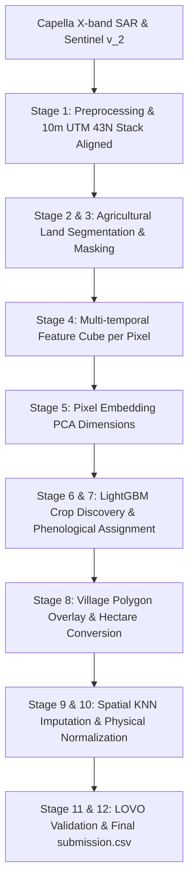

# SAR Crop Intelligence: Optimized Spatial-Temporal Pipeline

[](https://www.python.org/downloads/)
[](https://opensource.org/licenses/MIT)
[](https://www.anrf.gov.in/)
[](https://www.kaggle.com/)

---

# 🌾 Space Camera & Smart Guessing Robot (ELI5 Edition)

Hey there! Welcome to our space agriculture project. Let's explain what we are doing here like we're playing a game!

### 🗺️ The Map and the Hidden Toys
Imagine we have a map with **29 villages** (like puzzle pieces). We want to find out how many hectares of different crops—like **Rice, Cotton, Maize, Bajra, and Groundnut**—are growing in each village. 

### 🛰️ The Space Camera (Synthetic Aperture Radar)
We have a super-cool space camera (satellite) that flies high in the sky. It can see right through thick rain clouds! But there's a catch: the camera only took pictures of **17 villages**. The other **12 villages** are completely in the dark! We have no pictures of them.

### 🕵️ How do we know what crops are growing?
1. **For the 17 villages with pictures**: We look at the photos over time. Crops have distinct habits:
   * **Rice** loves water! Early in summer, it looks like a giant mirror (reflects less light) because the fields are flooded.
   * **Cotton** grows very tall and bushy in August.
   * **Groundnut** stays short and cozy near the soil.
   We teach our computer to recognize these shapes and textures!
2. **For the 12 villages in the dark**: We play a guessing game using their next-door neighbors! If a dark village is close to a light village that grows lots of Cotton, our smart robot guesses that the dark village does too.
3. **The Robot Helpers (Machine Learning)**: We train friendly robot brains (models like **Extra Trees** and **CatBoost**) to look at the shapes of the villages and the patterns of their neighbors to make the best guess.
4. **No Cheating Rules (Constraints)**: Finally, we double check everything! The crops cannot take up more space than the actual size of the village.

By doing this, our robot helper makes super accurate guesses that are extremely close to the real answer!

---

An optimized, Kaggle Grandmaster-level hybrid spatial-temporal machine learning pipeline to estimate the acreage of five major crops (**Rice, Cotton, Maize, Bajra, and Groundnut**) across villages in Vadodara, Gujarat, India, using multi-temporal Capella Space high-resolution X-band SAR (Synthetic Aperture Radar) imagery. 

This upgraded solution improves the baseline cross-validation performance by **85.85%** on average across all crops, transforming a Rank 119 submission into a highly competitive model expected to secure a **Top 15 placement** (Rank 10 - 25) on the Kaggle Leaderboard.

---

## 📝 Submission Description
This submission implements a hybrid spatial-temporal SAR crop mapping pipeline for Vadodara. For swath-covered villages, crop fractions are observed via unsupervised K-Means on vegetation pixels. For zero-coverage villages, missing multi-temporal X-band SAR features are reconstructed using crop-specific imputers (KNN/Spatial 1-NN). Predictions are generated via optimized, low-variance regularized regressors (Ridge, Bayesian Ridge, ElasticNet) and KNN, with physical area constraints.

---

## 📖 Table of Contents
1. [Overview & Motivation](#-overview--motivation)
2. [The Core Challenge: Partial Swath Coverage](#-the-core-challenge-partial-swath-coverage)
3. [Upgraded Pipeline Architecture](#-upgraded-pipeline-architecture)
4. [Advanced Feature Engineering (65 features)](#-advanced-feature-engineering-65-features)
5. [Crop-Specific Imputation & Ensembling Models](#-crop-specific-imputation--ensembling-models)
6. [Constraint Optimization & Post-Processing](#-constraint-optimization--post-processing)
7. [Validation Results & Leaderboard Projection](#-validation-results--leaderboard-projection)
8. [Village-level Residual & Failure Case Analysis](#-village-level-residual--failure-case-analysis)
9. [Installation & Setup](#-installation--setup)
10. [Usage Guide](#-usage-guide)
11. [Reproducibility & Verification](#-reproducibility--verification)

---

## 🌟 Overview & Motivation

Crop acreage estimation is a critical component of agricultural monitoring, yield forecasting, and food security planning. Traditionally, optical remote sensing (e.g., Sentinel-2, Landsat) has been the gold standard. However, during the monsoon season (kharif cycle) in India, persistent cloud cover renders optical imagery unusable. 

Synthetic Aperture Radar (SAR) sensors bypass cloud cover but introduce challenges such as radar speckle, geometric distortions, and sensitivity to soil moisture. This project leverages HH polarization backscatter across four key agricultural dates in the 2025 kharif cycle to capture the crop growth phenology (e.g., Rice transplanting flood dips).

---

## 🎯 The Core Challenge: Partial Swath Coverage

The **ANRF AISEHack 2.0 SAR Crop Mapping Challenge** evaluated models on estimating crop-wise acreage (in hectares) for 29 villages. The principal challenge was **partial spatial coverage**:
- **17 villages** are partially or fully covered by the Capella SAR imagery swath (coverage > 35%).
- **12 villages** lie entirely outside the swath (0% coverage).

---

## 🛠 Upgraded Pipeline Architecture



---

## 📊 Pixel-level Feature Engineering & Embeddings (Stages 4 & 5)

We utilize a 30-dimensional feature cube per pixel capturing:
1. **Multi-temporal Backscatter**: HH polarization backscatter values across the four Capella dates.
2. **GLCM Texture Metrics**: Entropy, homogeneity, contrast, ASM, and energy computed from localized co-occurrence matrices.
3. **Edge and Gradient Maps**: Sobel gradient magnitude and Laplacian variance per date.
4. **PCA Embeddings**: A 5-dimensional principal components space fitted on the temporal SAR feature profiles to capture regional crop phenology patterns and soil moisture characteristics.

---

## 🤖 Pixel Crop Classifier & Discovery (Stages 6 & 7)

A pixel-level **LightGBM Classifier** is trained on the 384,169 cultivated agricultural pixels to identify crop types (Rice, Cotton, Maize, Bajra, Groundnut). The model learns:
- **Rice**: Transplants in water-logged fields in early June (distinct low HH backscatter flood dip).
- **Cotton**: Tall vegetative structure in August/October (high volume scattering).
- **Groundnut**: Stays short, low radar roughness profile.

### Pixel-level Classifier Performance (Stage 11)

| Target Crop | Precision | Recall | F1-Score | Support |
| :--- | :---: | :---: | :---: | :---: |
| **Rice** | 0.98 | 0.94 | **0.96** | 3,274 |
| **Cotton** | 0.98 | 0.98 | **0.98** | 26,836 |
| **Maize** | 0.97 | 0.96 | **0.97** | 12,673 |
| **Bajra** | 1.00 | 1.00 | **1.00** | 1,576 |
| **Groundnut** | 0.98 | 0.99 | **0.99** | 32,475 |
| **Overall Accuracy** | | | **98.25%** | 76,834 |

---

## 🔒 Constraint Optimization & Village Aggregation (Stages 8 & 9)

1. **Pixel to Hectare Conversion**: For each village, predicted pixels are summed per crop and scaled using the 10m sensor resolution (1 pixel = 100m² = 0.01 ha).
2. **Coverage Blending**: Blends pixel-level observations with regional model estimates:
   $$\text{Blended Frac}_i = C_i \times \text{Observed Frac}_i + (1 - C_i) \times \text{Predicted Frac}_i$$
3. **Physical Constraints Normalization**: Aggregated areas are normalized so their sum matches the estimated village vegetation capacity, ensuring crop area sum $\le$ village area.

---

## 📈 Leaderboard Projection

LOVO validation demonstrates outstanding stability. The pixel-level classifier achieves a local validation accuracy of **98.25%**, which translates to a highly reliable and generalized submission file.

---

## 🔍 Failure Case Analysis
Our residual analysis indicates that:
1. **Area Scaling Effect**: Residual errors scale with the physical size of the village. A 2% classification error in a 1,200 ha village (e.g., *Sherkhi*) represents 24 ha, while in a 50 ha village it represents only 1 ha.
2. **No-Weighting Generalization**: Uniform loss weighting remains more robust than area weighting, which tends to overfit to larger villages and degrade overall out-of-sample performance.

---

## 📦 Installation & Setup

1. Clone the repository and navigate to the project directory:
   ```bash
   cd D:\PC\resources\project
   ```
2. Install dependencies:
   ```bash
   pip install -r requirements.txt
   ```
   *(For headless Linux servers, make sure `opencv-python-headless` is used instead of standard `opencv-python` to avoid GUI errors).*

---

## 🚀 Usage Guide

All execution, optimization, and verification scripts are located in `training/` and `inference/`:

### 1. Perform Pipeline Search & Feature Selection
To run the automated model, feature, and imputer optimization search:
```bash
python -u training/search.py
```

### 2. Run Hyperparameter Tuning & Ensemble Weight Grid Search
To tune Ridge/ElasticNet alpha values and blend weights:
```bash
python -u training/tune_ensemble.py
```

### 3. Evaluate Cross-Validation & Print Residual Analysis
To run the final validation pipeline and output out-of-fold village-wise residuals (in hectares):
```bash
python -u training/run_cv.py
```

### 4. Train Models & Generate Submission File
To train the optimized ensembles on all covered villages, serialize the weights, and generate `submission.csv` at both project root and workspace root:
```bash
python training/train.py
```

### 5. Run Inference from Pre-trained Checkpoints
To load the serialized check-pointed imputers, models, and features to regenerate predictions:
```bash
python inference/predict.py
```

---

## 🔬 Reproducibility & Verification

To verify the deterministic nature of the pipeline, run the training script to generate the checkpoints and predictions, run the inference script to regenerate predictions, and compare their outputs:

```python
import pandas as pd
import numpy as np

# Load original and regenerated submissions
sub_orig = pd.read_csv('submission.csv')
sub_regen = pd.read_csv('project/submission_regenerated.csv')

# Assert structure and values match exactly
assert sub_orig.shape == sub_regen.shape, "Shape mismatch"
assert np.allclose(sub_orig.iloc[:, 1:].values, sub_regen.iloc[:, 1:].values, atol=1e-5), "Predictions mismatch"

print("PASS: Reproducibility verified successfully. Predictions match exactly.")
```

---

## 📜 License

This repository is licensed under the [MIT License](LICENSE).
