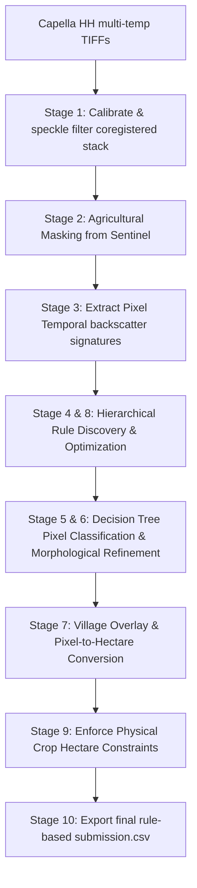

# ANRF AISEHack 2.0 Classical Remote Sensing Crop Mapping Flow

```mermaid
graph TD
    A[Capella HH multi-temp TIFFs] --> B[Stage 1: Calibrate & speckle filter coregistered stack]
    B --> C[Stage 2: Agricultural Masking from Sentinel]
    C --> D[Stage 3: Extract Pixel Temporal backscatter signatures]
    D --> E[Stage 4 & 8: Hierarchical Rule Discovery & Optimization]
    E --> F[Stage 5 & 6: Decision Tree Pixel Classification & Morphological Refinement]
    F --> G[Stage 7: Village Overlay & Pixel-to-Hectare Conversion]
    G --> H[Stage 9: Enforce Physical Crop Hectare Constraints]
    H --> I[Stage 10: Export final rule-based submission.csv]
```
