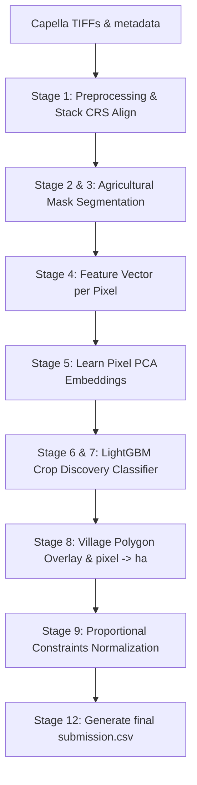

# ANRF AISEHack 2.0 Pixel-level Crop Mapping Diagram

```mermaid
graph TD
    A[Capella TIFFs & metadata] --> B[Stage 1: Preprocessing & Stack CRS Align]
    B --> C[Stage 2 & 3: Agricultural Mask Segmentation]
    C --> D[Stage 4: Feature Vector per Pixel]
    D --> E[Stage 5: Learn Pixel PCA Embeddings]
    E --> F[Stage 6 & 7: LightGBM Crop Discovery Classifier]
    F --> G[Stage 8: Village Polygon Overlay & pixel -> ha]
    G --> H[Stage 9: Proportional Constraints Normalization]
    H --> I[Stage 12: Generate final submission.csv]
```
